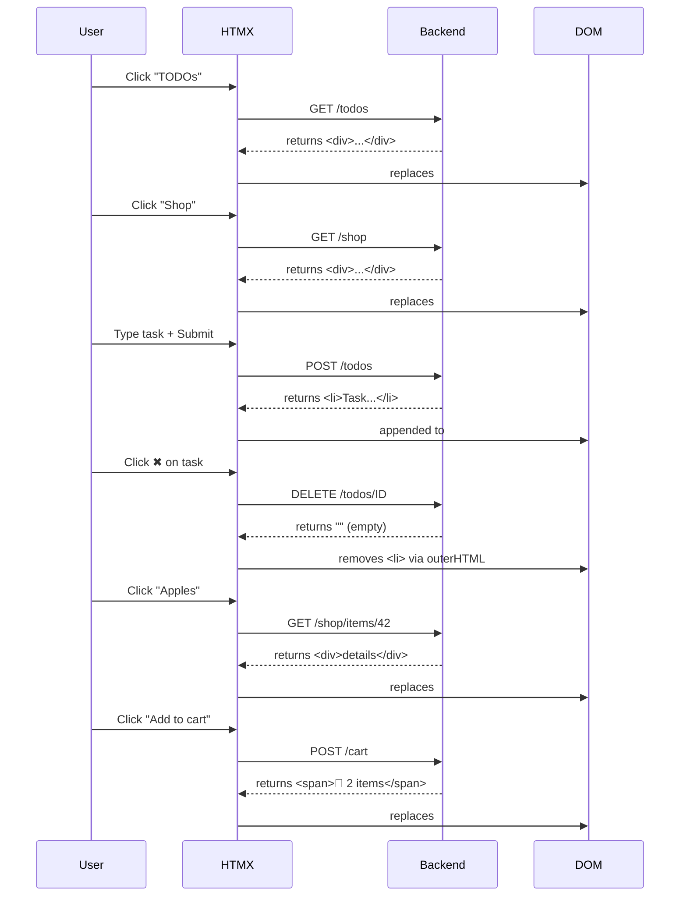

# HTMZ

## Interaction diagram



## Stress test

```txt
k6 run load-test/progressive-test.js

         /\      Grafana   /‾‾/  
    /\  /  \     |\  __   /  /   
   /  \/    \    | |/ /  /   ‾‾\ 
  /          \   |   (  |  (‾)  |
 / __________ \  |_|\_\  \_____/ 

     execution: local
        script: load-test/progressive-test.js
        output: -

     scenarios: (100.00%) 1 scenario, 10000 max VUs, 2m0s max duration (incl. graceful stop):
              * progressive_load: Up to 10000 looping VUs for 1m30s over 5 stages (gracefulRampDown: 30s, gracefulStop: 30s)

INFO[0091] 
=== PROGRESSIVE LOAD TEST: PLATEAU PERFORMANCE ===
📊 PLATEAU 1 (5K VUs - 30s):
  Requests: 2201997
  Req/s: 73400
  Avg Response Time: 26.88ms
  95th Percentile: 139.57ms

📊 PLATEAU 2 (10K VUs - 30s):
  Requests: 0
  Req/s: 0
  Avg Response Time: N/Ams
  95th Percentile: N/Ams

=== OVERALL RESULTS ===
Peak VUs: 10000
Total Requests: 4413994
Failed Requests: 0.00%
Overall Requests/sec: 48938.3 req/s
Avg Response Time: 27.77ms
95th Percentile: 147.53ms  source=console


  █ THRESHOLDS 

    http_req_duration
    ✓ 'p(95)<5000' p(95)=147.52ms


  █ TOTAL RESULTS 

    checks_total.......: 4403994 48827.422919/s
    checks_succeeded...: 100.00% 4403994 out of 4403994
    checks_failed......: 0.00%   0 out of 4403994

    ✓ add to cart status 200
    ✓ remove from cart status 200

    HTTP
    http_req_duration..............: avg=27.76ms   min=28µs     med=9.29ms   max=2.49s   p(90)=51.84ms  p(95)=147.52ms
      { expected_response:true }...: avg=27.76ms   min=28µs     med=9.29ms   max=2.49s   p(90)=51.84ms  p(95)=147.52ms
    http_req_duration_5k...........: avg=26.883481 min=0.028    med=8.76     max=525.557 p(90)=51.199   p(95)=139.57  
    http_req_failed................: 0.00%   0 out of 4413994
    http_reqs......................: 4413994 48938.293695/s
    http_reqs_5k...................: 2201997 24413.71146/s

    EXECUTION
    iteration_duration.............: avg=270.65ms  min=200.13ms med=245.92ms max=4.67s   p(90)=430.86ms p(95)=491.41ms
    iterations.....................: 2201997 24413.71146/s
    vus............................: 509     min=287          max=10000
    vus_max........................: 10000   min=10000        max=10000

    NETWORK
    data_received..................: 985 MB  11 MB/s
    data_sent......................: 1.1 GB  12 MB/s


running (1m30.2s), 00000/10000 VUs, 2201997 complete and 0 interrupted iterations
progressive_load ✓ [======================================] 00000/10000 VUs  1m30s
```