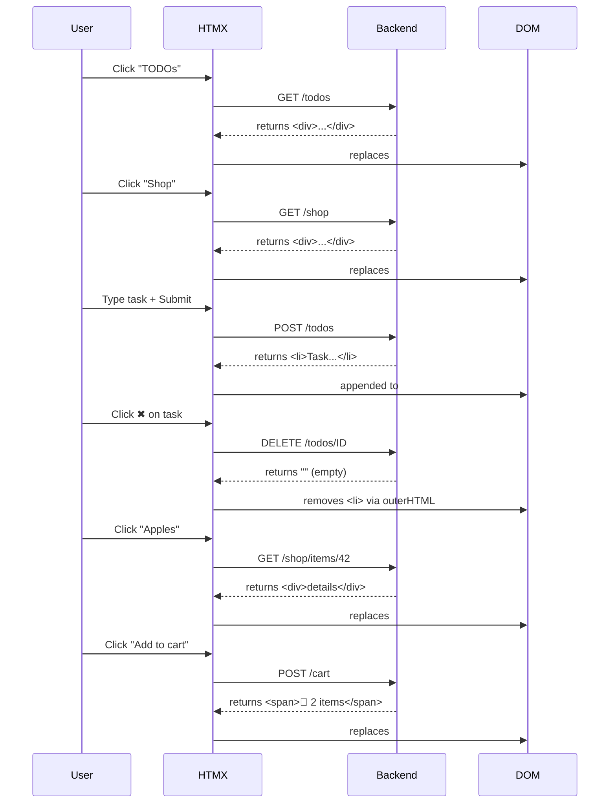

# HTMZ

## Interaction diagram

```mermaid
sequenceDiagram
	participant User
	participant HTMX
	participant Backend
	participant DOM

	User->>HTMX: Click "TODOs"
	HTMX->>Backend: GET /todos
	Backend-->>HTMX: returns <div>...</div>
	HTMX->>DOM: replaces #content

	User->>HTMX: Click "Shop"
	HTMX->>Backend: GET /shop
	Backend-->>HTMX: returns <div>...</div>
	HTMX->>DOM: replaces #content

	User->>HTMX: Type task + Submit
	HTMX->>Backend: POST /todos
	Backend-->>HTMX: returns <li>Task...</li>
	HTMX->>DOM: appended to #todo-list

	User->>HTMX: Click ✖ on task
	HTMX->>Backend: DELETE /todos/ID
	Backend-->>HTMX: returns "" (empty)
	HTMX->>DOM: removes <li> via outerHTML

	User->>HTMX: Click "Apples"
	HTMX->>Backend: GET /shop/items/42
	Backend-->>HTMX: returns <div>details</div>
	HTMX->>DOM: replaces #item-details

	User->>HTMX: Click "Add to cart"
	HTMX->>Backend: POST /cart
	Backend-->>HTMX: returns <span>🛒 2 items</span>
	HTMX->>DOM: replaces #cart
```
