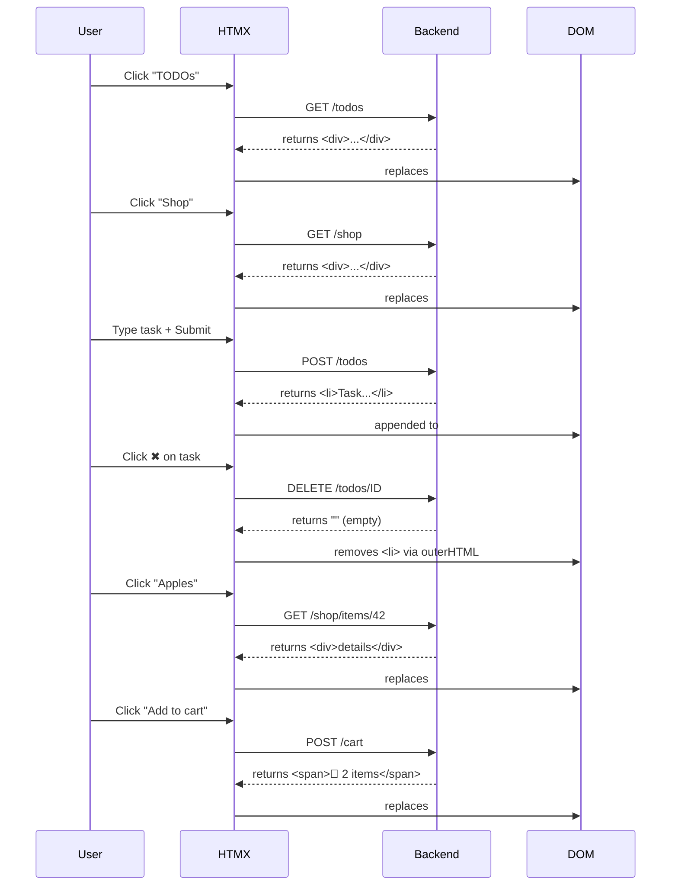

# HTMZ

## Interaction diagram

## Stress test

k6 run load-test/loadtest.js

         /\      Grafana   /‾‾/  
    /\  /  \     |\  __   /  /   
   /  \/    \    | |/ /  /   ‾‾\ 
  /          \   |   (  |  (‾)  |
 / __________ \  |_|\_\  \_____/ 

     execution: local
        script: load-test/loadtest.js
        output: -

     scenarios: (100.00%) 1 scenario, 6000 max VUs, 1m0s max duration (incl. graceful stop):
              * default: 6000 looping VUs for 30s (gracefulStop: 30s)

  █ TOTAL RESULTS 

    HTTP
    http_req_duration..............: avg=77.28ms min=36µs     med=45.32ms max=526.75ms p(90)=205.27ms p(95)=259.4ms 
      { expected_response:true }...: avg=77.34ms min=36µs     med=45.32ms max=526.75ms p(90)=205.46ms p(95)=259.62ms
    http_req_failed................: 2.29%  19924 out of 868516
    http_reqs......................: 868516 26364.588987/s

    EXECUTION
    iteration_duration.............: avg=2.36s   min=515.18ms med=2.36s   max=4.74s    p(90)=3.24s    p(95)=3.45s   
    iterations.....................: 78956  2396.780817/s
    vus............................: 68     min=68              max=6000
    vus_max........................: 6000   min=6000            max=6000

    NETWORK
    data_received..................: 1.9 GB 58 MB/s
    data_sent......................: 79 MB  2.4 MB/s

running (0m32.9s), 0000/6000 VUs, 78956 complete and 0 interrupted iterations
default ✓ [======================================] 6000 VUs  30s