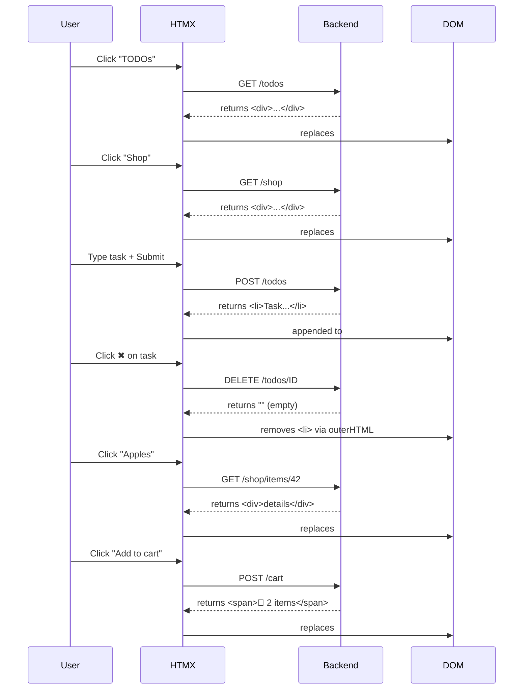

# HTMZ

## Interaction diagram



## Stress test

```txt
k6 run load-test/progressive-test.js

         /\      Grafana   /‾‾/  
    /\  /  \     |\  __   /  /   
   /  \/    \    | |/ /  /   ‾‾\ 
  /          \   |   (  |  (‾)  |
 / __________ \  |_|\_\  \_____/ 

     execution: local
        script: load-test/progressive-test.js
        output: -

     scenarios: (100.00%) 1 scenario, 10000 max VUs, 2m0s max duration (incl. graceful stop):
              * progressive_load: Up to 10000 looping VUs for 1m30s over 5 stages (gracefulRampDown: 30s, gracefulStop: 30s)

INFO[0092] 
=== PROGRESSIVE LOAD TEST: PLATEAU PERFORMANCE ===
📊 PLATEAU 1 (5K VUs - 30s):
  Requests: 1324484
  Req/s: 44149
  Avg Response Time: 7.16ms
  95th Percentile: 54.15ms

📊 PLATEAU 2 (10K VUs - 30s):
  Requests: 1786100
  Req/s: 59537
  Avg Response Time: 43.03ms
  95th Percentile: 194.68ms

=== OVERALL RESULTS ===
Peak VUs: 10000
Total Requests: 4287964
Failed Requests: 0.00%
Overall Requests/sec: 47524.5 req/s
Avg Response Time: 25.31ms
95th Percentile: 141.35ms  source=console


  █ THRESHOLDS 

    http_req_duration
    ✓ 'p(95)<5000' p(95)=141.34ms


  █ TOTAL RESULTS 

    checks_total.......: 4277964 47413.699995/s
    checks_succeeded...: 100.00% 4277964 out of 4277964
    checks_failed......: 0.00%   0 out of 4277964

    ✓ add to cart status 200
    ✓ remove from cart status 200

    HTTP
    http_req_duration..............: avg=25.31ms   min=23µs     med=6.36ms   max=548.83ms p(90)=60.09ms  p(95)=141.34ms
      { expected_response:true }...: avg=25.31ms   min=23µs     med=6.36ms   max=548.83ms p(90)=60.09ms  p(95)=141.34ms
    http_req_duration_10k..........: avg=43.034363 min=0.026    med=24.322   max=548.832  p(90)=137.5042 p(95)=194.675 
    http_req_duration_5k...........: avg=7.164567  min=0.024    med=0.467    max=185.903  p(90)=17.865   p(95)=54.147  
    http_req_failed................: 0.00%   0 out of 4287964
    http_reqs......................: 4287964 47524.532391/s
    http_reqs_10k..................: 1786100 19795.774242/s
    http_reqs_5k...................: 1324484 14679.573513/s

    EXECUTION
    iteration_duration.............: avg=275.44ms  min=200.13ms med=247.84ms max=812.94ms p(90)=427.74ms p(95)=482.99ms
    iterations.....................: 2138982 23706.849997/s
    vus............................: 599     min=247          max=10000
    vus_max........................: 10000   min=10000        max=10000

    NETWORK
    data_received..................: 957 MB  11 MB/s
    data_sent......................: 1.0 GB  12 MB/s


running (1m30.2s), 00000/10000 VUs, 2138982 complete and 0 interrupted iterations
progressive_load ✓ [======================================] 00000/10000 VUs  1m30s
```
