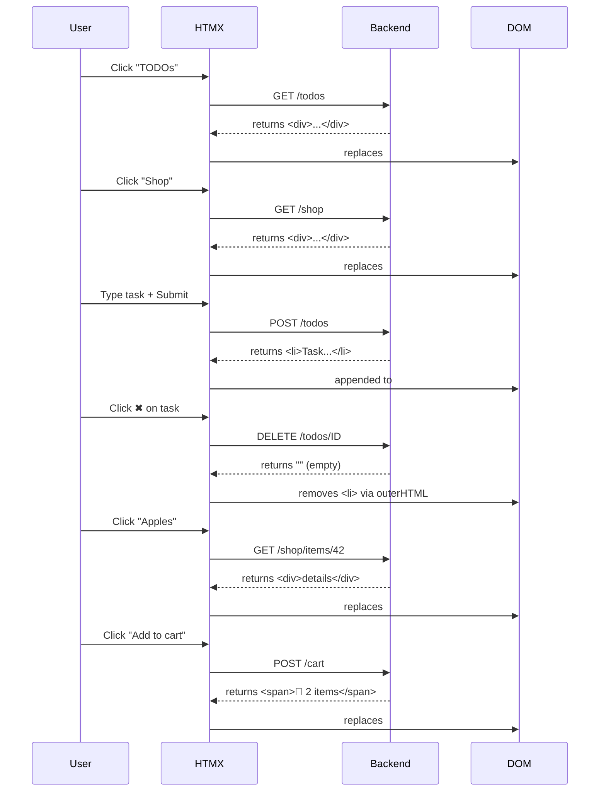

# HTMZ

## Interaction diagram



## Stress testwith `k6`

<details><summary>k6 code</summary>

```js
import http from "k6/http";
import { sleep } from "k6";
import { check } from "k6";
import { Trend, Counter } from "k6/metrics";
import exec from "k6/execution";

export const options = {
  scenarios: {
    progressive_load: {
      executor: "ramping-vus",
      startVUs: 0,
      stages: [
        { duration: "10s", target: 5000 }, // Ramp to 5K users
        { duration: "30s", target: 5000 }, // Hold at 5K users (Plateau 1)
        { duration: "10s", target: 10000 }, // Ramp to 10K users
        { duration: "30s", target: 10000 }, // Hold at 10K users (Plateau 2)
        { duration: "10s", target: 0 }, // Ramp down
      ],
    },
  },
  thresholds: {
    http_req_duration: ["p(95)<5000"], // 95% under 5s
  },
};

const BASE_URL = "http://localhost:8080";
const itemIds = [1, 2, 3, 4, 5, 6, 7];

// Custom metrics per plateau
const plateau5k = new Trend("http_req_duration_5k");
const plateau10k = new Trend("http_req_duration_10k");
const requests5k = new Counter("http_reqs_5k");
const requests10k = new Counter("http_reqs_10k");

// Global JWT cookie for this VU
let jwtCookie = null;

export default function () {
  // Get a real JWT token from server if we don't have one
  if (!jwtCookie) {
    const response = http.get(`${BASE_URL}/`, { timeout: "30s" });
    const cookieHeader = response.headers["Set-Cookie"];
    if (cookieHeader) {
      const match = cookieHeader.match(/jwt_token=([^;]+)/);
      if (match) {
        jwtCookie = match[1];
      }
    }

    // If still no cookie, something is wrong
    if (!jwtCookie) {
      console.error("Failed to get JWT cookie from server");
      return;
    }
  }

  // Determine current stage using k6 execution context elapsed time
  const elapsedMs = Date.now() - exec.scenario.startTime;
  const elapsedSeconds = elapsedMs / 1000;

  let currentStage = "none";
  // 10-40s: 5K plateau (10s ramp + 30s hold)
  if (elapsedSeconds >= 10 && elapsedSeconds <= 40) currentStage = "plateau5k";
  // 50-80s: 10K plateau (after 10s ramp, 30s hold)
  if (elapsedSeconds >= 50 && elapsedSeconds <= 80) currentStage = "plateau10k";


  const randomItemId = itemIds[Math.floor(Math.random() * itemIds.length)];

  // Headers with current JWT as cookie
  const headers = () => ({
    Cookie: `jwt_token=${jwtCookie}`,
    "Content-Type": "application/json",
  });

  // 1. Add item to cart
  let response = http.post(`${BASE_URL}/api/cart/add/${randomItemId}`, null, {
    headers: headers(),
    timeout: "30s",
  });

  // Record metrics only during actual plateaus
  if (currentStage === "plateau5k") {
    plateau5k.add(response.timings.duration);
    requests5k.add(1);
  } else if (currentStage === "plateau10k") {
    plateau10k.add(response.timings.duration);
    requests10k.add(1);
  }
  // Ignore ramp periods ("none")

  check(response, {
    "add to cart status 200": (r) => r.status === 200,
  });
  sleep(0.2);

  // 2. Remove from cart (simplified for extreme load)
  response = http.del(`${BASE_URL}/api/cart/remove/${randomItemId}`, null, {
    headers: headers(),
    timeout: "30s",
  });

  // Record metrics for remove request too
  if (currentStage === "plateau5k") {
    plateau5k.add(response.timings.duration);
    requests5k.add(1);
  } else if (currentStage === "plateau10k") {
    plateau10k.add(response.timings.duration);
    requests10k.add(1);
  }

  check(response, {
    "remove from cart status 200": (r) => r.status === 200,
  });

  sleep(0.1);
}

export function handleSummary(data) {
  const metrics = data.metrics;

  // Calculate requests per second for each plateau
  const plateau5kReqs = metrics.http_reqs_5k?.values?.count || 0;
  const plateau10kReqs = metrics.http_reqs_10k?.values?.count || 0;

  // Plateau durations (30s each)
  const reqs5kPerSec = plateau5kReqs / 30;
  const reqs10kPerSec = plateau10kReqs / 30;

  console.log(`
=== PROGRESSIVE LOAD TEST: PLATEAU PERFORMANCE ===
📊 PLATEAU 1 (5K VUs - 30s):
  Requests: ${plateau5kReqs.toLocaleString()}
  Req/s: ${reqs5kPerSec.toFixed(0)}
  Avg Response Time: ${
    metrics.http_req_duration_5k?.values?.avg?.toFixed(2) || "N/A"
  }ms
  95th Percentile: ${
    metrics.http_req_duration_5k?.values?.["p(95)"]?.toFixed(2) || "N/A"
  }ms

📊 PLATEAU 2 (10K VUs - 30s):
  Requests: ${plateau10kReqs.toLocaleString()}
  Req/s: ${reqs10kPerSec.toFixed(0)}
  Avg Response Time: ${
    metrics.http_req_duration_10k?.values?.avg?.toFixed(2) || "N/A"
  }ms
  95th Percentile: ${
    metrics.http_req_duration_10k?.values?.["p(95)"]?.toFixed(2) || "N/A"
  }ms

=== OVERALL RESULTS ===
Peak VUs: ${metrics.vus_max.values.max}
Total Requests: ${metrics.http_reqs.values.count}
Failed Requests: ${(metrics.http_req_failed.values.rate * 100).toFixed(2)}%
Overall Requests/sec: ${metrics.http_reqs.values.rate.toFixed(1)} req/s
Avg Response Time: ${metrics.http_req_duration.values.avg.toFixed(2)}ms
95th Percentile: ${metrics.http_req_duration.values["p(95)"].toFixed(2)}ms
`);
}
```

</details>

With the Context/App, we can run threads.

`Zap` config: 1 worker, 3 threads.

```txt
=== PROGRESSIVE LOAD TEST: PLATEAU PERFORMANCE ===
📊 PLATEAU 1 (5K VUs - 30s):
  Requests: 965360
  Req/s: 32179
  Avg Response Time: 2.31ms
  95th Percentile: 16.78ms

📊 PLATEAU 2 (10K VUs - 30s):
  Requests: 1544886
  Req/s: 51496
  Avg Response Time: 27.21ms
  95th Percentile: 153.87ms

=== OVERALL RESULTS ===
Peak VUs: 10000
Total Requests: 3427756
Failed Requests: 0.00%
Overall Requests/sec: 37955.1 req/s
Avg Response Time: 15.40ms
95th Percentile: 114.78ms  source=console


  █ THRESHOLDS 

    http_req_duration
    ✓ 'p(95)<5000' p(95)=114.77ms


  █ TOTAL RESULTS 

    checks_total.......: 3417756 37844.348922/s
    checks_succeeded...: 100.00% 3417756 out of 3417756
    checks_failed......: 0.00%   0 out of 3417756

    ✓ add to cart status 200
    ✓ remove from cart status 200

    HTTP
    http_req_duration..............: avg=15.4ms    min=23µs     med=508µs    max=363.09ms p(90)=36.74ms  p(95)=114.77ms 
      { expected_response:true }...: avg=15.4ms    min=23µs     med=508µs    max=363.09ms p(90)=36.74ms  p(95)=114.77ms 
    http_req_duration_10k..........: avg=27.209636 min=0.025    med=5.8335   max=363.092  p(90)=109.7655 p(95)=153.86675
    http_req_duration_5k...........: avg=2.310914  min=0.025    med=0.119    max=187.642  p(90)=5.754    p(95)=16.784   
    http_req_failed................: 0.00%   0 out of 3427756
    http_reqs......................: 3427756 37955.077566/s
    http_reqs_10k..................: 1544886 17106.313273/s
    http_reqs_5k...................: 965360  10689.300428/s

    EXECUTION
    iteration_duration.............: avg=348.65ms  min=300.13ms med=314.23ms max=778.49ms p(90)=469.78ms p(95)=523.13ms 
    iterations.....................: 1708878 18922.174461/s
    vus............................: 588     min=273          max=10000
    vus_max........................: 10000   min=10000        max=10000

    NETWORK
    data_received..................: 772 MB  8.5 MB/s
    data_sent......................: 838 MB  9.3 MB/s


running (1m30.3s), 00000/10000 VUs, 1708878 complete and 0 interrupted iterations
progressive_load ✓ [======================================] 00000/10000 VUs  1m30s
```

## Notes

- grab a cookie for testing:

```sh
curl -v -c cookies.txt http://localhost:8080/
```

- pass the cookie for testing:

```sh
curl -v -H "Cookie: jwt_token=test" http://localhost:8080/api/items
```

- test public endpoint:

```sh
curl -v http://localhost:8080/groceries
```

- Useful!:

```sh
pkill -f "htmz"

lsof -ti:8080 | xargs kill
kill sell: xxxx
```
