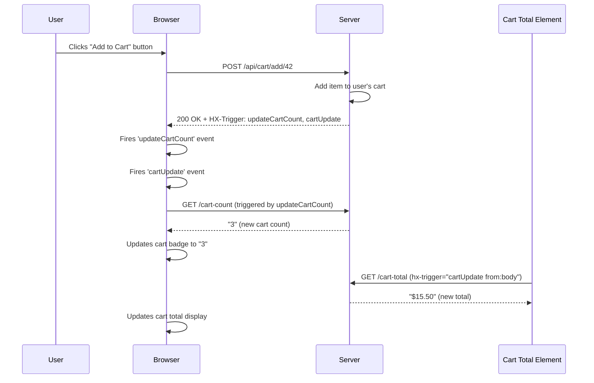
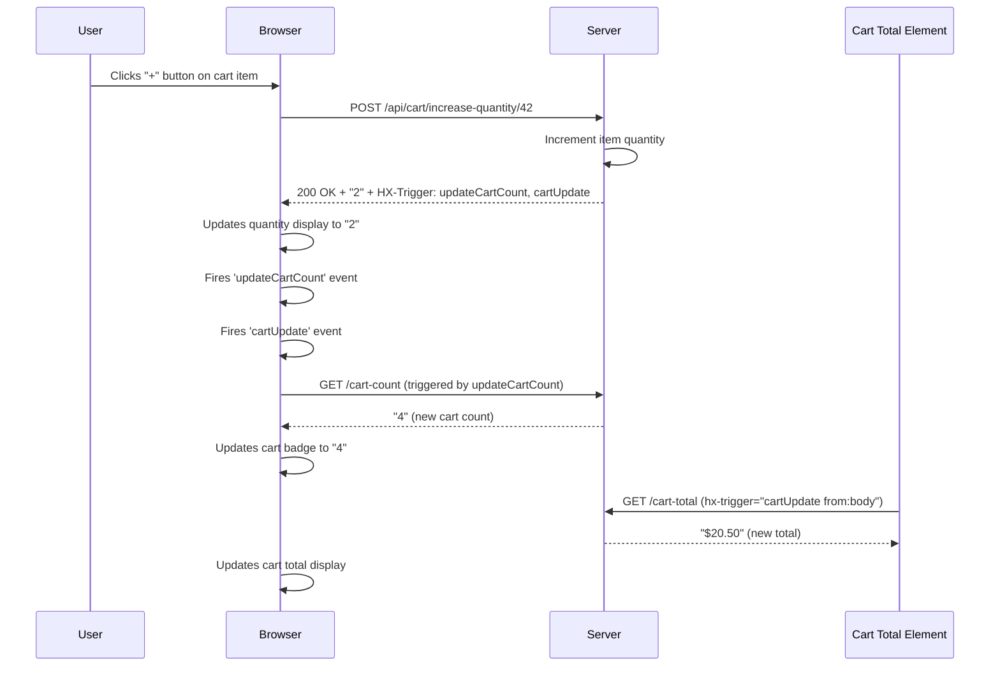

# HTMZ

It displays a grocery list where you can view the details of each product. It holds the price.
You can select a product to add to the shopping list. A total number of items gets updated.
In the shopping cart, you can increase/decrease the quantity and remove the item. The total value is calculated.

- `SQLite` in memory used for the grocery items list
- HashMap to hold the users' shopping cart
- WebSocket to remove the shopping cart when disconnects

Deployed on a small VPS.

## HTMX Cart Update Flow

This diagram shows how cart operations trigger real-time updates for both cart count and total:

### Scenario 1: Adding Item from Grocery List



### Scenario 2: Changing Quantity in Shopping Cart



**Key HTMX Concepts:**

- `hx-trigger="load, cartUpdate from:body"` - Element listens for events
- `HX-Trigger: cartUpdate` header - Server tells browser to fire events

## Stress test with `k6`

```sh
k6 run load-test/progressive-test.js
```

With the Context/App, we can run threads.

`Zap` config: 1 worker, 2 threads.

### Local tests

```txt
=== PROGRESSIVE LOAD TEST: PLATEAU PERFORMANCE ===
📊 PLATEAU 1 (5K VUs - 30s):
  Requests: 965360
  Req/s: 32179
  Avg Response Time: 2.31ms
  95th Percentile: 16.78ms

📊 PLATEAU 2 (10K VUs - 30s):
  Requests: 1544886
  Req/s: 51496
  Avg Response Time: 27.21ms
  95th Percentile: 153.87ms

=== OVERALL RESULTS ===
Peak VUs: 10000
Total Requests: 3427756
Failed Requests: 0.00%
Overall Requests/sec: 37955.1 req/s
Avg Response Time: 15.40ms
95th Percentile: 114.78ms  source=console


  █ THRESHOLDS 

    http_req_duration
    ✓ 'p(95)<5000' p(95)=114.77ms


  █ TOTAL RESULTS 

    checks_total.......: 3417756 37844.348922/s
    checks_succeeded...: 100.00% 3417756 out of 3417756
    checks_failed......: 0.00%   0 out of 3417756

    ✓ add to cart status 200
    ✓ remove from cart status 200

    HTTP
    http_req_duration..............: avg=15.4ms    min=23µs     med=508µs    max=363.09ms p(90)=36.74ms  p(95)=114.77ms 
      { expected_response:true }...: avg=15.4ms    min=23µs     med=508µs    max=363.09ms p(90)=36.74ms  p(95)=114.77ms 
    http_req_duration_10k..........: avg=27.209636 min=0.025    med=5.8335   max=363.092  p(90)=109.7655 p(95)=153.86675
    http_req_duration_5k...........: avg=2.310914  min=0.025    med=0.119    max=187.642  p(90)=5.754    p(95)=16.784   
    http_req_failed................: 0.00%   0 out of 3427756
    http_reqs......................: 3427756 37955.077566/s
    http_reqs_10k..................: 1544886 17106.313273/s
    http_reqs_5k...................: 965360  10689.300428/s

    EXECUTION
    iteration_duration.............: avg=348.65ms  min=300.13ms med=314.23ms max=778.49ms p(90)=469.78ms p(95)=523.13ms 
    iterations.....................: 1708878 18922.174461/s
    vus............................: 588     min=273          max=10000
    vus_max........................: 10000   min=10000        max=10000

    NETWORK
    data_received..................: 772 MB  8.5 MB/s
    data_sent......................: 838 MB  9.3 MB/s


running (1m30.3s), 00000/10000 VUs, 1708878 complete and 0 interrupted iterations
progressive_load ✓ [======================================] 00000/10000 VUs  1m30s
```

### Tests

Memory leak detection on in Debug mode

#### Memory Monitoring Commands Local Development

```sh
# Get process ID and initial memory baseline
SERVER_PID=$(pgrep -f 'zig-out/bin/htmz')
ps -o pid,vsz,rss,comm -p $SERVER_PID

# Monitor memory during stress test
ps -o pid,vsz,rss,comm -p $SERVER_PID && date
```

#### Run failure stress test to check memory behavior

```sh
cd load-test && k6 run failure-test.js
```

### VPS memory monitor

```sh
# Get process ID and initial memory baseline (adjust path for VPS)
cd opt/htmz
SERVER_PID=$(pgrep -f 'htmz')
ps -o pid,vsz,rss,comm -p $SERVER_PID

# Alternative if pgrep fails - find by process name
SERVER_PID=$(ps aux | grep '[h]tmz' | grep -v grep | awk '{print $2}')
ps -o pid,vsz,rss,comm -p $SERVER_PID

# Monitor memory during stress test
ps -o pid,vsz,rss,comm -p $SERVER_PID && date

# Check memory usage from /proc (more detailed)
cat /proc/$SERVER_PID/status | grep -E 'VmRSS|VmSize'
```

## Deploy on `Hetzner`

2 VCPU x86, 4GB RAM machine with `Debian` and `musl`
  
- static assets (HTML, CSS, SVG, HTMX.JS)

```sh
# copy gzipped static assets into "/public" folder
pnpm -F htmz make:public
```

- production built:

```sh
# build with target
zig build -Dtarget=x86_64-linux-musl -Doptimize=ReleaseFast
```

- copy local binaries and assets to the VPS

```sh
scp ./zig-out/bin/htmz root@ipv4-address:opt/htmz/htmz

scp -r public/ root@ipv4-address:opt/htmz/

scp .zig-cache/o/27f03ab08e098dc623c09f5bb4932c03/libfacil.io.so root@91.98.129.192:opt/htmz/lib/libfacil.io.so 
```

In the VPS:

```sh
root@debian-4gb-nbg1-1:~ cd opt/htmz && chmod +x htmz

root@debian-4gb-nbg1-1:~ LD_LIBRARY_PATH=./lib SECRET_KEY=ziggit ./htmz
```

- hammer the VPS from home:

```sh
BASE_URL=http://ipv4-address:8080 k6 run load-test/progressive-test.js 
```

## Notes

- grab a cookie for testing:

```sh
curl -v -c cookies.txt http://localhost:8080/
```

- pass the cookie for testing:

```sh
curl -v -H "Cookie: jwt_token=test" http://localhost:8080/api/items
```

- Useful!:

```sh
pkill -f "htmz"

lsof -ti:8080 | xargs kill
```
