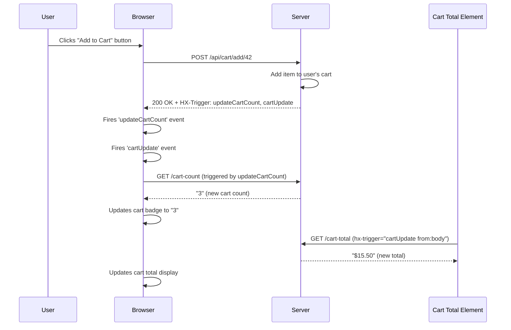
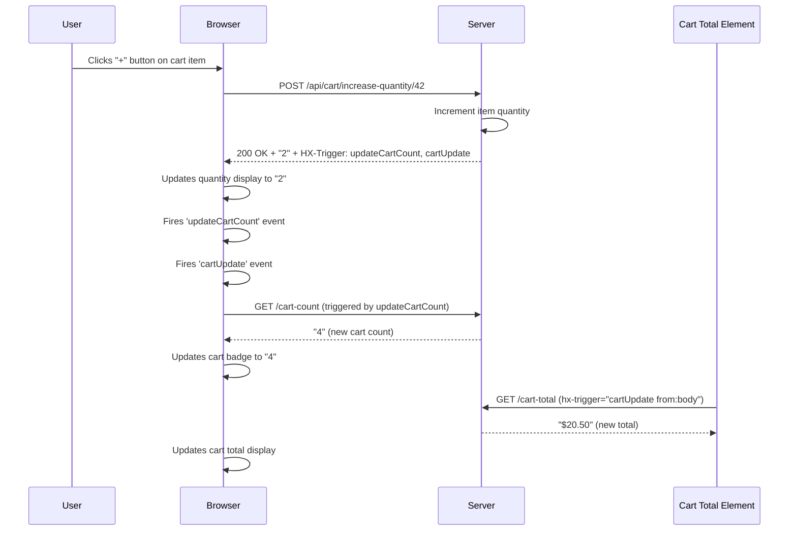

# HTMZ

It displays a grocery list where you can view the details of each product. It holds the price.
You can select a product to add to the shopping list. A total number of items gets updated.
In the shopping cart, you can increase/decrease the quantity and remove the item. The total value is calculated.

- `SQLite` with filed-based storage
- HashMap to hold the users' shopping cart
- WebSocket to remove the shopping cart when disconnects

## Tests

Settings:  `httpz`, 2 workers (2 VCPU), 32 thread_pool, SQLite 2 pool, ulimit = 131_000.

Local `Grafana k6` stress tests results: 10 req/s/VU

```sh
k6 run load-test/progressive-test.js
```

```txt
=== PROGRESSIVE LOAD TEST: PLATEAU PERFORMANCE ===
PLATEAU 1 (5K VUs - 30s):
  Requests: 949232
  Req/s: 31641
  Avg Response Time: 4.62ms
  95th Percentile: 26.79ms

PLATEAU 2 (10K VUs - 30s):
  Requests: 1408818
  Req/s: 46961
  Avg Response Time: 39.29ms
  95th Percentile: 154.88ms

=== OVERALL RESULTS ===
Peak VUs: 10000
Total Requests: 4082576
Failed Requests: 0.00%
```

- Remote `k6` stress tests on a production deployment (a small `Hetzner` VPS). 5 req/s/VU

Settings:  `httpz`, 2 workers (2 VCPU), 32 thred_pool, SQLite 2 pool, `ulimit` = 131_000.

```sh
k6 run load-test/hetzner.js
```

```txt
=== PROGRESSIVE LOAD TEST: PLATEAU PERFORMANCE ===
PLATEAU 1 (2K VUs - 30s):
  Requests: 262896
  Req/s: 8763
  Avg Response Time: 27.66ms
  95th Percentile: 32.10ms

PLATEAU 2 (6K VUs - 30s):
  Requests: 754194
  Req/s: 25140
  Avg Response Time: 36.08ms
  95th Percentile: 53.17ms

=== OVERALL RESULTS ===
Peak VUs: 6000
Total Requests: 1704638
Failed Requests: 0.00%
```

## HTMX Cart Update Flow

This diagram shows how cart operations trigger real-time updates for both cart count and total:

### Scenario 1: Adding Item from Grocery List



### Scenario 2: Changing Quantity in Shopping Cart



**Key HTMX Concepts:**

- `hx-trigger="load, cartUpdate from:body"` - Element listens for events
- `HX-Trigger: cartUpdate` header - Server tells browser to fire events

## Setup assets

Copy the `.gz` versions of _index.html_, _index.css_, _htmx.min.js_ and _ws.min.js_  into "/public",
and symlink the SVGs from src/html/svg into public/svg

```sh
pnpm --filter htmz update --recursive
```

```sh
pnpm --filter htmz make:public
ln -s src/html/svg public/svg
```


## Memory leak detection

Memory leak detection on in Debug mode with `std.posix.sigaction` (cf [this example](https://github.com/karlseguin/http.zig/blob/master/examples/09_shutdown.zig)).

### Memory Monitoring Commands Local Development

```sh
# Get process ID and initial memory baseline
SERVER_PID=$(pgrep -f 'zig-out/bin/htmz')
ps -o pid,vsz,rss,comm -p $SERVER_PID

# Monitor memory during stress test
ps -o pid,vsz,rss,comm -p $SERVER_PID && date
```

### Run failure stress test to check memory behavior

```sh
k6 run load-test/failure-test.js
```

### VPS memory monitor

```sh
# Get process ID and initial memory baseline (adjust path for VPS)
cd opt/htmz
SERVER_PID=$(pgrep -f 'htmz')
ps -o pid,vsz,rss,comm -p $SERVER_PID

# Alternative if pgrep fails - find by process name
SERVER_PID=$(ps aux | grep '[h]tmz' | grep -v grep | awk '{print $2}')
ps -o pid,vsz,rss,comm -p $SERVER_PID

# Monitor memory during stress test
ps -o pid,vsz,rss,comm -p $SERVER_PID && date

# Check memory usage from /proc (more detailed)
cat /proc/$SERVER_PID/status | grep -E 'VmRSS|VmSize'
```

## Deploy on `Hetzner`

CX22 machine, 2 VCPU x86, 4GB RAM machine with `Debian`.
  
- Static assets (HTML, CSS, SVG, HTMX.JS) are compiled into the code.
- The `SVG`s are saved as text into the SQLite database, and then fetched and interpolated as text into the rendered template.

Production built:

```sh
# build with target
zig build -Dtarget=x86_64-linux-gnu -Doptimize=ReleaseFast
```

- copy local binaries and assets to the VPS

```sh
scp ./zig-out/bin/htmz root@ipv4-address:opt/htmz/htmz-httpz

# the SVGs are saved in the /public/ssvsg folder. SQLite fills its "items" table with the SVGs as text.
scp -r public/ root@ipv4-address:opt/htmz/
```

In the VPS, test:

```sh
root@debian-4gb-nbg1-1:~ cd opt/htmz && chmod +x htmz-httpz

root@debian-4gb-nbg1-1:~ SECRET_KEY=ziggit ./htmz-httpz
```

- hammer the VPS from home: the `httpz` server is listening on port 8880 (to be `Cloudflare` compatible).

```sh
BASE_URL=http://ipv4-address:8880 k6 run load-test/progressive-test.js 
```

### Daemonize - Create service

```sh
root@debian-4gb-nbg1-1:~ 


sudo tee /etc/systemd/system/htmz-httpz.service > /dev/null << 'EOF'
[Unit]
  Description=HTMZ Web Server (httpz implementation)
  After=network.target

[Service]
  Type=simple
  User=root
  WorkingDirectory=/root/opt/htmz
  Environment=LD_LIBRARY_PATH=/root/opt/htmz/lib
  Environment=SECRET_KEY=ziggit
  ExecStart=/root/opt/htmz/htmz-httpz
  Restart=always
  # Set file descriptor limits
  LimitNOFILE=65536
  LimitNPROC=65536

[Install]
  WantedBy=multi-user.target
EOF
```

Start/stop the servce:

```sh
root@debian-4gb-nbg1-1:~ sudo systemctl daemon-reload
# auto-start on boot
root@debian-4gb-nbg1-1:~ sudo systemctl enable htmz-httpz

root@debian-4gb-nbg1-1:~ sudo systemctl start htmz-httpz
root@debian-4gb-nbg1-1:~ sudo systemctl status htmz-httpz

root@debian-4gb-nbg1-1:~ sudo systemctl stop htmz-httpz
root@debian-4gb-nbg1-1:~ sudo systemctl restart htmz-httpz
```

Logs:

```sh
sudo journalctl -u htmz-httpz -f   # Live logs
sudo journalctl -u htmz-httpz      # All logs
```

Check if the server is running: <https://httpz.htmz.online>

## Notes

`-v` lets you inspect the headers so you can see when cookies are being set and sent.

- grab a cookie for testing:

```sh
curl -v --cookie-jar cookies.txt http://localhost:8080/
```

(or `-v -c`)

- pass the cookie for testing a POST endpoint:

```sh
curl -v --cookie cookies.txt -X POST http://91.98.129.192:8080/api/cart/add/1
```

(or `-v -b`)

- Useful!:

```sh
pkill -f "htmz"

pgrep -f htmz
# <pid> 
lsof -it:8880 | xargs kill <pid>
```

## Results

### local

```txt
📊 PLATEAU 1 (2K VUs - 30s):
  Requests: 159094
  Req/s: 5303
  Avg Response Time: 26.84ms
  95th Percentile: 30.55ms

📊 PLATEAU 2 (6K VUs - 30s):
  Requests: 473560
  Req/s: 15785
  Avg Response Time: 29.00ms
  95th Percentile: 36.36ms

=== OVERALL RESULTS ===
Peak VUs: 6000
Total Requests: 1722822
Failed Requests: 0.00%
```

### Deployed on VPS
  
```txt
=== PROGRESSIVE LOAD TEST: PLATEAU PERFORMANCE ===
📊 PLATEAU 1 (2K VUs - 30s):
  Requests: 262914
  Req/s: 8764
  Avg Response Time: 27.67ms
  95th Percentile: 32.66ms

📊 PLATEAU 2 (8K VUs - 30s):
  Requests: 899734
  Req/s: 29991
  Avg Response Time: 59.65ms
  95th Percentile: 113.91ms

=== ZIG VPS OVERALL RESULTS ===
Peak VUs: 8000
Total Requests: 2223424
Failed Requests: 0.00%
```
